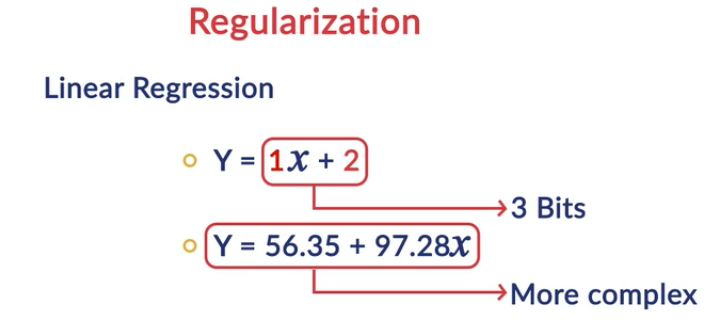
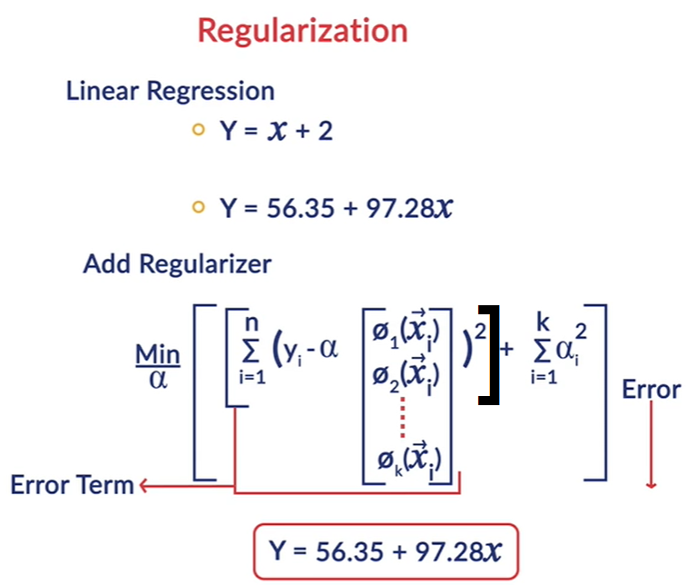
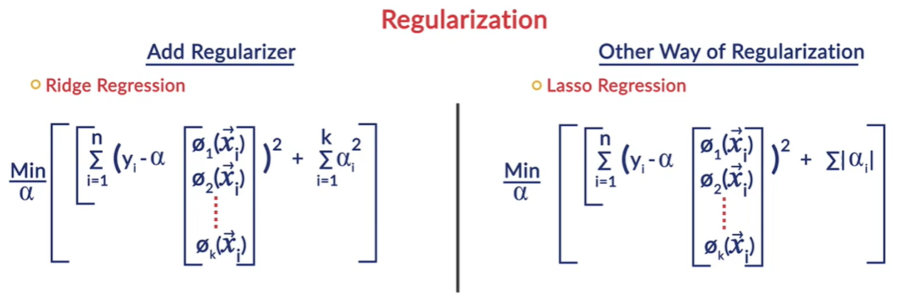
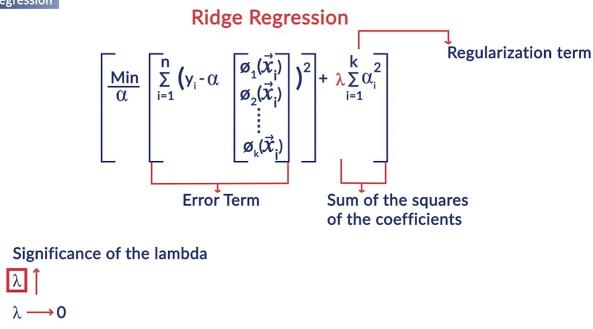
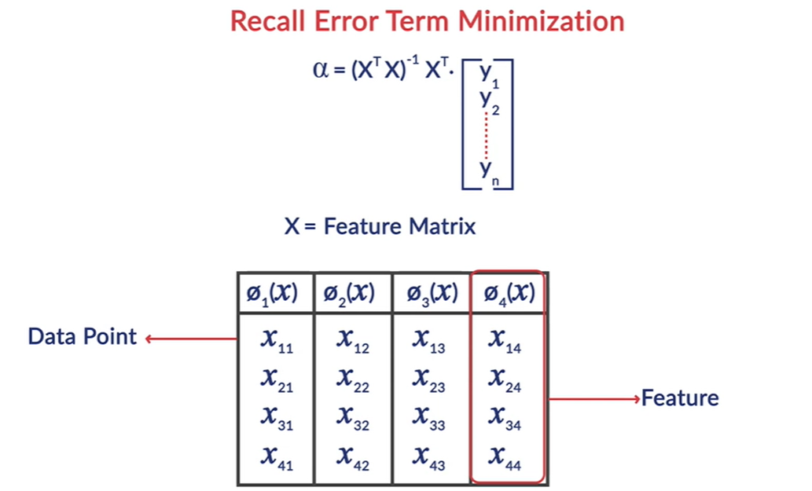
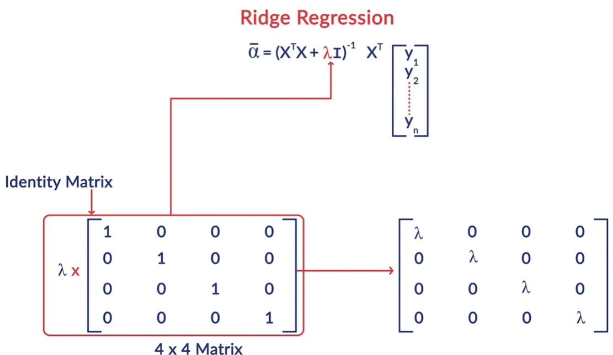
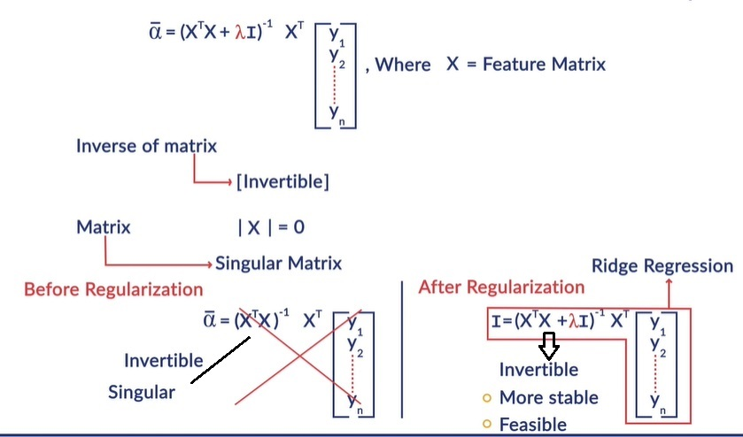
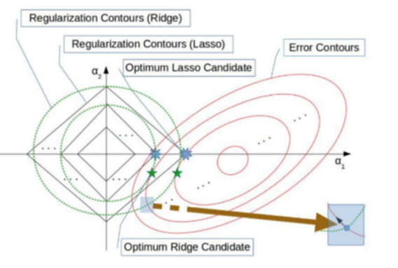

# Advanced Regression
In an earlier module, you had learnt the principles of model selection - model simplicity and complexity, overfitting, regularization etc. In this module, you will learn to apply model selection principles in the regression framework. 
Also, you will learn to extend the linear regression framework to problems which are not strictly 'linear' and understand the difference between linear and nonlinear regression problems.

This module covers the following two concepts: 
1. Generalized Linear Regression
2. Regularized Regression - Ridge and Lasso Regression

## Generalized Regression
In linear regression, you had encountered problems where the target variable y was linearly related to the predictor variables X. But what if the relationship is not linear? Let's see how we can use **generalised regression** to tackle such problems. 

The explanatory and response variables often do not vary in a linear manner, as illustrated in the following examples:
1. In the first example, notice that the data points oscillate and follow a sine or cosine type of function. 

2. In the second example of electricity consumption, the data points gradually increase non-linearly, indicative of a polynomial or an exponential function: 

You may recall that the general expression of a polynomial function is 

 If n=2, it is called a quadratic or a second-degree polynomial; if n=3, it is called a cubic or a third-degree polynomial.  
 Also, recall that the **roots of a polynomial** f(x) represent the values of x at which the function cuts the x-axis and that a polynomial function can have both **real or imaginary roots**.
 
 For example, the quadratic function **f(x)=x^2-5x+6** has two real roots: **x=2,3** , though the function **f(x)=x^2+2x+10** does not have any real roots (and does not cut the x-axis).  
 So how can we take the decision of fitting a polynomial model, a sine curve or any other function by just looking at the plot? You'll learn to do that in the next segment.

## Generalized Regression Framework-1
Let's now learn how to extend the regression framework to examples where the data does not follow a linear pattern. The generic process consists of the following two steps: 
1. Conduct exploratory data analysis by examining scatter plots of explanatory and dependent variables.
2. Choose an appropriate set of functions which seem to fit the plot well, build models using them, and compare the results.

Let's now see the typical shapes of commonly occurring functions. Further, we will also learn how functions are created with derived features instead of raw attributes, and what is meant by **non-linear features**.

Raw attributes, as they appear in the training data, may not be the ones best suited to predict the response variable value with. 
In the blood pressure example, the attributes weight and height are individually not indicative of the blood pressure, though a derived feature such as BMI could predict it well. The derived features could be **combinations of two or more attributes** and/or **transformations of individual attributes**. These combinations and transformations could be **linear or non-linear**.

Note that a linear combination of two attributes **x1** and **X2** allows only two operations - multiplying by a constant and adding the results. For example, **3x1+5x2** is a linear combination, though **2*x1*x2** is a non-linear combination.

Refer to the blog on feature engineering from Jason Brownlee (https://machinelearningmastery.com/discover-feature-engineering-how-to-engineer-features-and-how-to-get-good-at-it/) to learn more about the importance of feature extraction from raw attributes.

### Generalized Regression Framework-2
In the previous segment, we discussed that in generalised linear regression we analyse the scatter plots of the raw attributes to create new features. We also saw several commonly used functions.

The next step is to compute the optimal coefficients of the model, i.e. to fit the model such that some cost function is minimised. The process is exactly analogous to what you have studied in linear regression with the only difference that the attributes are now replaced by feature functions.

This is the correct matrix representation: 

1. In generalised regression models, the basic algorithm remains the same as linear regression- we compute the values of coefficients which result in the least possible error (best fit). The only difference is that we now use the features 

instead of the raw attributes.

2. The term 'linear' in linear regression refers to the linearity in the coefficients, i.e. the target variable **y is linearly related to the model coefficients**. It does **not** require that y should be linearly related to the raw attributes or features - feature functions could be non-linear as well.

### 'Linear' in Linear Regression
The second point mentioned above is so important (and so often confused) that it is worth elaborating - the model is called 'linear' because the target **y is linearly related to the coefficients.**

To fully understand this, it is crucial to note that in regression, the **coefficients a0,a1,a2,...ak are your variables** , i.e. you are trying to find the optimal coefficients which minimise some loss function. On the other hand, the features

are actually **constants** since you are already given the dataset (i.e. the values of **x**,  and hence ϕ(x), are fixed - what you are trying to tune are the coefficients). 

Thus, saying that '**y** is linearly related to the coefficients' implies that **only two operations** can be applied between the coefficients - 1) Multiplying them by constants (i.e. the features) such as 

 

and 2) Adding the terms with each other such as 

What you cannot do is multiply them together, raise to one another's power, etc. That is, you cannot have terms such as

### Systems of Linear Equations
In this segment, we will revisit an important linear algebra concept that will be useful in the upcoming lectures - solving a **system of linear equations** using matrices. If you are already familiar with this, feel free to quickly skim through this page.

#### Systems of Linear Equations

### Generalized Regression Framework-3
In the previous few segments, we had looked at the general framework for solving any regression problem. We also saw how a system of linear equations can be solved using matrices.

### Generalized Regression in Python
Let's now learn to implement generalised regression in Python. Download the dataset and the Jupyter notebook used below:

[Electricity Consumption in US](dataset/total-electricity-consumption-us.csv)

[Generalized Regression practice file](dataset/generalised_regression.ipynb)

In summary, in order to best fit a non-linear curve to the data, we figure out how close is the set of predicted values to the set of given values for the response variable just like in simple linear regression. The only additional thing you need to do is to pick the right features or functions of raw attributes and run a regression on features instead of a regression on raw attributes.

To summarize, you learnt that one needs to follow a 3-step process to build a regression model:  

1. First, explore and visualize raw attributes to understand the shape of scatter plots.
2. Second, we assessed which function of the explanatory variable would explain the shape of the data.  
3. Lastly, we wrote the generalized regression formula using the matrix format. We then summed up the errors between predicted and actual response variables and minimised the residual sum of error to arrive at the best-fit regression curve 
Another thing to note is that the term 'linear' in regression depicts the linear expression in the coefficients of the linear combination. It does not mean linear expression in raw attributes or features.

## Regularized Regression
A predictive model has to be as simple as possible, but no simpler. There is an important relationship between the complexity of a model and its usefulness in a learning context because of the following reasons: 
1. Simpler models are usually more generic and are more widely applicable (are generalizable)
2. Simpler models require fewer training samples for effective training than the more complex ones

**Regularization** is a process used to create an optimally complex model, i.e. a model which is as simple as possible while performing well on the training data. Through regularization, one tries to strike the delicate balance between keeping the model simple, yet not making it too naive to be of any use.

Essentially what the regularized regression framework does is to treat the sum of the squares of the cofficient as the measure of the model complexity and while we are trying to bring the error down by minimizing the sum of cumulative squares, we don't want alpha(cofficients) which characterize the model to become way to complex. So we balance the error term by adding another term which is sum of the sqauares of the cofficients. 

## Ridge and Lasso Regression - I
You saw that linear regression does not account for model complexity - it only tries to minimize the error (e.g. MSE), although if it may result in arbitrarily complex coefficients. On the other hand,  in regularized regression, the objective function has two parts - the **error term** and the **regularization term.**

Lambda in above expression is called regularization cofficient which is the hyperparameter. A high value of lambda means we are putting lot of premium in controlling the complexity of the model. So any increase in the complexity of the model(increase in cofficents) would be clamped down forcefully by the lambda as the value of lambda is large i.e. it will not allow cofficients to be very large. 
If lambda is close to zero then we are essentially doing a unregularized regression, then we are only worried about how we can bring the error term down and we don't care about whether the model itself become complex. So we can say that lambda is the balancing factor. 
Lambda equal to zero implies that there is no regularization and there is a high chance of overfitting.

**Formula for calculating alpha without regularization:**

**Formula for calculating alpha with regularization:**

In the formula on the left side before regularization, if X transpose X is singular then it cannot be inverted then this formula on left side can't be applied. However when we do regularization and use the modified formula on the right hand side, by adding lambda on all the diagonal elements of X transpose X then it turns out that the new matrix is far more likely to be invertible than the original matrix. 
Apart from the fact that regularization term results in a model which is not very complex. It also has this unexpected benefit which makes this whole process computationally far more stable and feasible than the original unregularized formulation of regression. This is ridge regression.

There is another popular scheme of regularization which can be applied is called Lasso Regression. In ridge regression, an additional term of "sum of the squares of the coefficients" is added to the cost function along with the error term, whereas in case of lasso regression,  a regularisation term of  "sum of the absolute value of the coefficients" is added.  
Computationally lasso regression is far more intensive than ridge regression. Mathematically lasso is not as clean because you have to do an iterative procedure to arrive at the optimum whereas in ridge regression we have nice clean formula for the best fit alpha.

We discussed the two commonly used regularised regression methods - Ridge regression and Lasso regression. Both these methods are used to make the regression model simpler while balancing the 'bias-variance' tradeoff. 

### Pros and Cons of ridge and lasso regularization techniques
One of the most important benefits of Lasso regression is that it results in model parameters such that the lesser important features' coefficients become zero. In other words, Lasso regression indirectly performs **feature selection**.

## Ridge and Lasso Regression - II (Error and Regularization Contourss)
We saw that both Ridge and Lasso techniques regularize the coefficients by reducing their magnitude. In other words, they cause **shrinkage** of the coefficients. Ridge and Lasso perform shrinkage differently. Specifically, Lasso shrinks some of the coefficients to zero, thus performing **feature selection**. Let's try to understand how this happens.

Let's say that we have two model parameters (coefficients) **α1** and **α2** whose optimal values are to be found. We know that the **regularised cost function** has two components — the **error term** and the **regularisation term**. The figure below is a schematic illustration of the error (red lines) and regularisation terms (green dotted curves for ridge regression and solid blue lines for lasso regression) contours. The two axes represent 
α1 and α2 respectively.

A **contour** of a function **f(α)** is a trace (locus) of the points that satisfy the equation **f(α)=c** for some constant **c**. The figure shows contours for various values of c — the 'inner' contours represent lower values of the error/regularisation terms. You want to find the coefficients which **minimise both the error and the regularisation terms.**

The zoomed picture of one of the crossings between an error contour and a regularisation contour in the figure illustrates this — at every crossing one could move along the arrow (black arrow in the zoomed image) shown to keep the error term same and reduce the regularisation term, giving a better solution (i.e. the sum of the coefficients reduces while keeping the error the same).

Thus, the key observation here is that at the optimum solution for α (the place where the sum of the error and regularisation terms is minimum), the corresponding regularisation contour and the error contour must 'touch' each other tangentially and not 'cross'.

The 'blue stars' highlight the touch points between the error contours and the lasso regularisation contours. The 'green stars' highlight the touch points between the error contours and the ridge regularisation terms. The picture illustrates the fact that because of the 'corners' in the lasso contours (unlike ridge regression), the touch points are more likely to be on one or more of the axes. This implies that the other **coefficients become zero**. Hence, lasso regression also serves as a feature selection method, whereas ridge regression does not. 

## Ridge and Lasso Regression in Python
Recall the car price case study that you had solved in 'Multiple Linear Regression'. In this segment, we will analyse the same problem and fit Ridge and Lasso Regression models.

We will also perform grid-search cross-validation to tune the regularisation hyperparameter λ. 

[Ridge and Lasso Regression Practice File](dataset/Car+Price+Prediction+-+Ridge+and+Lasso+Regression.ipynb)

We see that the graphs are also similar but a lot of coefficients seen at the end in case of Lasso are zero, which means Lasso has performed variable selection.

