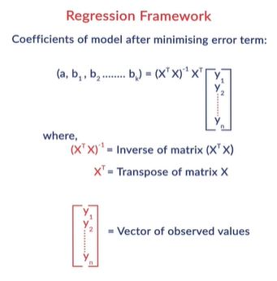

# Advanced Regression
In an earlier module, you had learnt the principles of model selection - model simplicity and complexity, overfitting, regularization etc. In this module, you will learn to apply model selection principles in the regression framework. 
Also, you will learn to extend the linear regression framework to problems which are not strictly 'linear' and understand the difference between linear and nonlinear regression problems.

This module covers the following two concepts: 
1. Generalized Linear Regression
2. Regularized Regression - Ridge and Lasso Regression

## Generalized Regression
In linear regression, you had encountered problems where the target variable y was linearly related to the predictor variables X. But what if the relationship is not linear? Let's see how we can use **generalised regression** to tackle such problems. 

The explanatory and response variables often do not vary in a linear manner, as illustrated in the following examples:
1. In the first example, notice that the data points oscillate and follow a sine or cosine type of function. 

2. In the second example of electricity consumption, the data points gradually increase non-linearly, indicative of a polynomial or an exponential function: 

You may recall that the general expression of a polynomial function is 

 If n=2, it is called a quadratic or a second-degree polynomial; if n=3, it is called a cubic or a third-degree polynomial.  
 Also, recall that the **roots of a polynomial** f(x) represent the values of x at which the function cuts the x-axis and that a polynomial function can have both **real or imaginary roots**.
 
 For example, the quadratic function **f(x)=x^2-5x+6** has two real roots: **x=2,3** , though the function **f(x)=x^2+2x+10** does not have any real roots (and does not cut the x-axis).  
 So how can we take the decision of fitting a polynomial model, a sine curve or any other function by just looking at the plot? You'll learn to do that in the next segment.

## Generalized Regression Framework-1
Let's now learn how to extend the regression framework to examples where the data does not follow a linear pattern. The generic process consists of the following two steps: 
1. Conduct exploratory data analysis by examining scatter plots of explanatory and dependent variables.
2. Choose an appropriate set of functions which seem to fit the plot well, build models using them, and compare the results.

Let's now see the typical shapes of commonly occurring functions. Further, we will also learn how functions are created with derived features instead of raw attributes, and what is meant by **non-linear features**.

Raw attributes, as they appear in the training data, may not be the ones best suited to predict the response variable value with. 
In the blood pressure example, the attributes weight and height are individually not indicative of the blood pressure, though a derived feature such as BMI could predict it well. The derived features could be **combinations of two or more attributes** and/or **transformations of individual attributes**. These combinations and transformations could be **linear or non-linear**.

Note that a linear combination of two attributes **x1** and **X2** allows only two operations - multiplying by a constant and adding the results. For example, **3x1+5x2** is a linear combination, though **2*x1*x2** is a non-linear combination.

Refer to the blog on feature engineering from Jason Brownlee (https://machinelearningmastery.com/discover-feature-engineering-how-to-engineer-features-and-how-to-get-good-at-it/) to learn more about the importance of feature extraction from raw attributes.

### Generalized Regression Framework-2
In the previous segment, we discussed that in generalised linear regression we analyse the scatter plots of the raw attributes to create new features. We also saw several commonly used functions.

The next step is to compute the optimal coefficients of the model, i.e. to fit the model such that some cost function is minimised. The process is exactly analogous to what you have studied in linear regression with the only difference that the attributes are now replaced by feature functions.

This is the correct matrix representation: 

1. In generalised regression models, the basic algorithm remains the same as linear regression- we compute the values of coefficients which result in the least possible error (best fit). The only difference is that we now use the features 

instead of the raw attributes.

2. The term 'linear' in linear regression refers to the linearity in the coefficients, i.e. the target variable **y is linearly related to the model coefficients**. It does **not** require that y should be linearly related to the raw attributes or features - feature functions could be non-linear as well.

### 'Linear' in Linear Regression
The second point mentioned above is so important (and so often confused) that it is worth elaborating - the model is called 'linear' because the target **y is linearly related to the coefficients.**

To fully understand this, it is crucial to note that in regression, the **coefficients a0,a1,a2,...ak are your variables** , i.e. you are trying to find the optimal coefficients which minimise some loss function. On the other hand, the features

are actually **constants** since you are already given the dataset (i.e. the values of **x**,  and hence ϕ(x), are fixed - what you are trying to tune are the coefficients). 

Thus, saying that '**y** is linearly related to the coefficients' implies that **only two operations** can be applied between the coefficients - 1) Multiplying them by constants (i.e. the features) such as 

 

and 2) Adding the terms with each other such as 

What you cannot do is multiply them together, raise to one another's power, etc. That is, you cannot have terms such as

### Systems of Linear Equations
In this segment, we will revisit an important linear algebra concept that will be useful in the upcoming lectures - solving a **system of linear equations** using matrices. If you are already familiar with this, feel free to quickly skim through this page.

#### Systems of Linear Equations

### Generalized Regression Framework-3
In the previous few segments, we had looked at the general framework for solving any regression problem. We also saw how a system of linear equations can be solved using matrices.

### Generalized Regression in Python
Let's now learn to implement generalised regression in Python. Download the dataset and the Jupyter notebook used below:

[Electricity Consumption in US](dataset/total-electricity-consumption-us.csv)

[Generalized Regression practice file](dataset/generalised_regression.ipynb)

